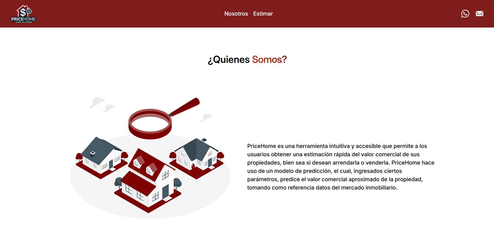

# PriceHome

PriceHome es una herramienta intuitiva y accesible desarrollada como proyecto final para el curso **Ingeniería de Software**. Este proyecto permite a los usuarios obtener una estimación rápida del valor comercial de sus propiedades, ya sea para arrendar o vender.

## Descripción del Proyecto

PriceHome utiliza un modelo de predicción de precios inmobiliarios que, a partir de ciertos parámetros proporcionados por el usuario, calcula un valor comercial aproximado de la propiedad. El modelo toma como referencia datos del mercado inmobiliario de Colombia, específicamente de la plataforma [FincaRaiz](https://www.fincaraiz.com.co), lo que permite que las estimaciones sean precisas y relevantes para el contexto local.

## Características

- **Estimación de valor comercial:** Predice el valor de venta o alquiler de una propiedad.
- **Modelo de predicción basado en machine learning:** Uso de un archivo `.pkl` para la carga del modelo que realiza las predicciones.
- **Interfaz intuitiva:** Proporciona una experiencia de usuario fácil de usar para acceder a estimaciones de valor comercial en pocos pasos.

## Uso

- Ingresar los datos en cada uno de los campos del formulario

- Hacer click en el botón estimar

## Desarrollado por

- Argenis Eduardo Omaña Molina
- Daniel Ortiz Aristizábal
- Felipe Torres Montoya
- Sebastián Monsalve Gómez
